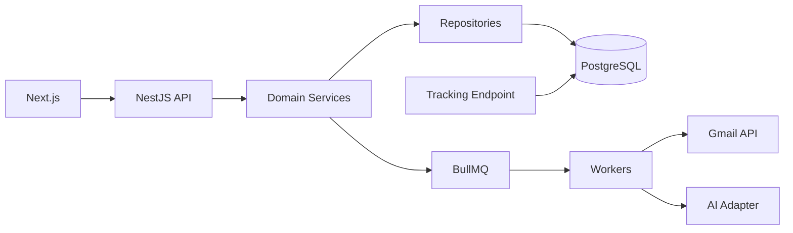

# 02_ARCHITECTURE.md

## システムアーキテクチャ実装仕様

## 1. 結論
UI、API、Domain Service、Repository、Adapter、Workerを分離する。Controllerに業務ロジックを書かず、Serviceに状態遷移を集約する。

## 2. 全体構成


## 3. レイヤ責務
| Layer | 責務 |
|---|---|
| Controller | HTTP、DTO、認証認可 |
| Service | 業務フロー、状態遷移 |
| Repository | Prisma DBアクセス |
| Adapter | Gmail、AI、SMTP等外部API |
| Worker | 非同期送信、同期、集計 |

## 4. 推奨ディレクトリ
```text
apps/web/features/{dashboard,leads,mail,replies,tasks}
apps/api/src/modules/{companies,projects,leads,mail,ai,tracking,tasks,audit}
apps/api/src/workers/{mail-send,reply-sync,ai-generation}
packages/shared/src
prisma/schema.prisma
openapi/openapi.yaml
docs/
```

## 5. 状態遷移
Leadは `discovered -> qualified -> drafted -> reviewing -> approved -> queued -> contacted -> replied` を基本とする。Mailは `draft -> in_review -> approved -> queued -> sending -> sent` を基本とする。


---

## Codex実装条件
- docs/ を正本として実装する。
- DB変更時は `docs/07_DATABASE.md` と `prisma/schema.prisma` を同時更新する。
- API変更時は `docs/06_API.md` と `openapi/openapi.yaml` を同時更新する。
- AI生成・メール送信・承認・配信停止は必ずログを残す。
- MVPではAI生成メールの自動送信は禁止。人間承認を必須にする。
