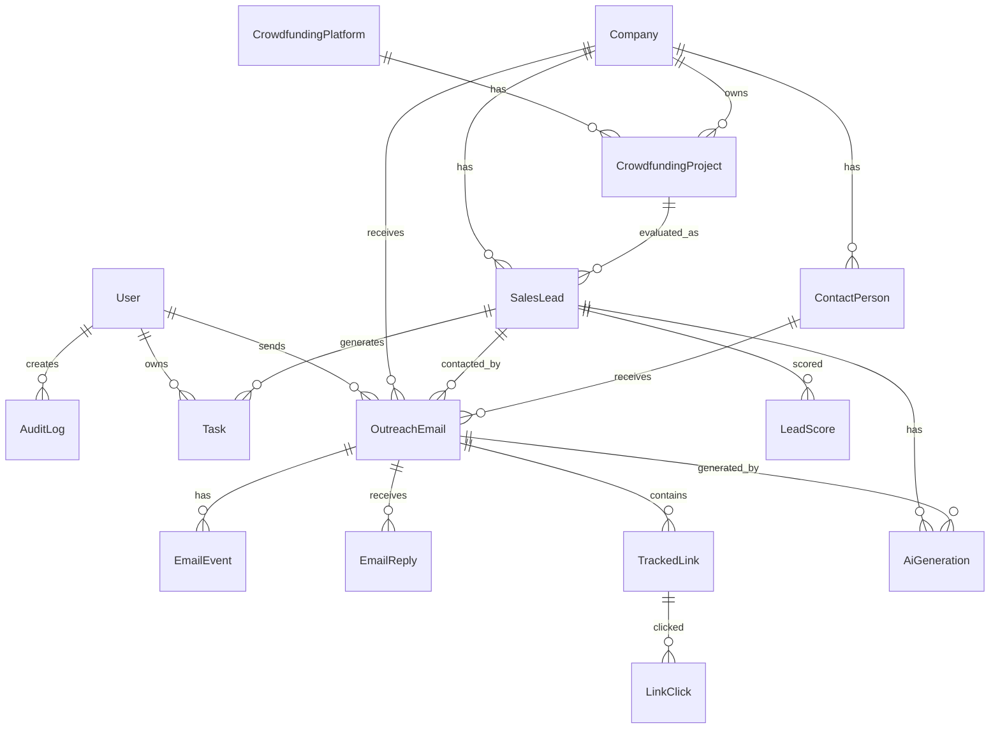

# 07_DATABASE.md

## 営業AIシステム Database 実装仕様

- 対象: 営業AIシステム Phase2
- 位置づけ: Codex 実装用 DB 仕様
- 正本: `docs/07_DATABASE.md`
- ORM: Prisma
- DB: PostgreSQL
- ID 方針: UUID / CUID 系ではなく DB 側 UUID を基本
- 削除方針: 原則 Soft Delete
- 監査方針: 主要業務操作は `AuditLog` に記録

---

## 1. 結論

このシステムのDBは、以下の業務を一気通貫で扱える構成にする。

1. 営業対象サイトの管理
2. クラウドファンディング案件の収集
3. 営業候補の判定
4. 会社・担当者・連絡先の管理
5. 営業メール作成・送信・返信管理
6. 資料リンクのクリック計測
7. タスク管理
8. AI生成履歴管理
9. 監査ログ管理

Codex は本仕様をもとに、Prisma schema、migration、seed、Repository層、API実装を行う。

---

## 2. DB設計方針

### 2.1 設計原則

| 原則 | 内容 |
|---|---|
| 実装優先 | 抽象的な設計ではなく、Prismaで実装できる粒度にする |
| 営業実務優先 | 案件収集、候補化、メール送信、返信管理を中心にする |
| 人間確認を前提 | AI判定・AI文章生成は保存するが、確定操作は人間が行う |
| 追跡可能性 | 誰が、いつ、何を変更したか追えるようにする |
| 再送・重複防止 | 同じ会社・同じ案件に無駄な営業をしない |
| 将来拡張 | CAMPFIRE以外にMakuake、GREEN FUNDING等を追加できる構造にする |

---

## 3. ER図



---

## 4. Enum定義

### 4.1 Role

| 値 | 意味 |
|---|---|
| ADMIN | 管理者 |
| MANAGER | 営業管理者 |
| MEMBER | 通常メンバー |
| VIEWER | 閲覧のみ |

### 4.2 PlatformType

| 値 | 意味 |
|---|---|
| CAMPFIRE | CAMPFIRE |
| MAKUAKE | Makuake |
| GREEN_FUNDING | GREEN FUNDING |
| READYFOR | READYFOR |
| OTHER | その他 |

### 4.3 ProjectStatus

| 値 | 意味 |
|---|---|
| DRAFT | 下書き |
| ACTIVE | 公開中 |
| FUNDED | 達成済み |
| ENDED | 終了 |
| UNKNOWN | 不明 |

### 4.4 LeadStatus

| 値 | 意味 |
|---|---|
| NEW | 新規 |
| REVIEW_REQUIRED | 人間確認待ち |
| APPROVED | 営業対象として承認済み |
| REJECTED | 対象外 |
| CONTACTED | 初回接触済み |
| REPLIED | 返信あり |
| MEETING_SET | 商談設定済み |
| PROPOSAL_SENT | 提案済み |
| WON | 受注 |
| LOST | 失注 |
| ARCHIVED | アーカイブ |

### 4.5 EmailStatus

| 値 | 意味 |
|---|---|
| DRAFT | 下書き |
| REVIEW_REQUIRED | 確認待ち |
| REJECTED | 棄却 |
| APPROVED | 送信承認済み |
| SCHEDULED | 送信予約済み |
| SENT | 送信済み |
| FAILED | 送信失敗 |
| REPLIED | 返信あり |
| CANCELED | キャンセル |

### 4.6 EmailEventType

| 値 | 意味 |
|---|---|
| SENT | 送信 |
| REJECTED | 棄却 |
| OPENED | 開封 |
| CLICKED | クリック |
| REPLIED | 返信 |
| BOUNCED | バウンス |
| FAILED | 失敗 |

### 4.7 TaskStatus

| 値 | 意味 |
|---|---|
| TODO | 未着手 |
| IN_PROGRESS | 対応中 |
| DONE | 完了 |
| CANCELED | 中止 |

### 4.8 AiGenerationType

| 値 | 意味 |
|---|---|
| LEAD_ANALYSIS | 営業候補分析 |
| EMAIL_DRAFT | メール下書き |
| REPLY_ANALYSIS | 返信分析 |
| TASK_SUGGESTION | タスク提案 |
| OTHER | その他 |

---

## 5. 全テーブル仕様

## 5.1 User

システム利用者。

| カラム | 型 | 必須 | 説明 |
|---|---|---:|---|
| id | String | yes | UUID |
| name | String | yes | 表示名 |
| email | String | yes | ログイン・通知用メール |
| role | Role | yes | 権限 |
| isActive | Boolean | yes | 有効ユーザーか |
| createdAt | DateTime | yes | 作成日時 |
| updatedAt | DateTime | yes | 更新日時 |
| deletedAt | DateTime? | no | 論理削除日時 |

制約:

- `email` は unique
- `deletedAt` が null のユーザーを有効扱い

---

## 5.2 CrowdfundingPlatform

営業対象のクラウドファンディングサイト。

| カラム | 型 | 必須 | 説明 |
|---|---|---:|---|
| id | String | yes | UUID |
| type | PlatformType | yes | サイト種別 |
| name | String | yes | 表示名 |
| baseUrl | String | yes | ベースURL |
| isActive | Boolean | yes | 収集対象か |
| createdAt | DateTime | yes | 作成日時 |
| updatedAt | DateTime | yes | 更新日時 |
| deletedAt | DateTime? | no | 論理削除日時 |

制約:

- `type` は unique

---

## 5.3 Company

営業先企業・事業者。

| カラム | 型 | 必須 | 説明 |
|---|---|---:|---|
| id | String | yes | UUID |
| name | String | yes | 会社名・屋号 |
| normalizedName | String | yes | 重複判定用正規化名 |
| websiteUrl | String? | no | 公式サイト |
| inquiryUrl | String? | no | 問い合わせURL |
| email | String? | no | 代表メール |
| phone | String? | no | 電話番号 |
| prefecture | String? | no | 都道府県 |
| city | String? | no | 市区町村 |
| industry | String? | no | 業種 |
| memo | String? | no | メモ |
| createdAt | DateTime | yes | 作成日時 |
| updatedAt | DateTime | yes | 更新日時 |
| deletedAt | DateTime? | no | 論理削除日時 |

制約:

- `normalizedName` に index
- `email` に index
- 完全な unique にはしない。屋号重複・複数部署を考慮する。

---

## 5.4 ContactPerson

会社の担当者。

| カラム | 型 | 必須 | 説明 |
|---|---|---:|---|
| id | String | yes | UUID |
| companyId | String | yes | Company FK |
| name | String? | no | 担当者名 |
| department | String? | no | 部署 |
| title | String? | no | 役職 |
| email | String? | no | メール |
| phone | String? | no | 電話 |
| source | String? | no | 取得元 |
| createdAt | DateTime | yes | 作成日時 |
| updatedAt | DateTime | yes | 更新日時 |
| deletedAt | DateTime? | no | 論理削除日時 |

---

## 5.5 CrowdfundingProject

収集したクラウドファンディング案件。

| カラム | 型 | 必須 | 説明 |
|---|---|---:|---|
| id | String | yes | UUID |
| platformId | String | yes | Platform FK |
| companyId | String? | no | Company FK |
| externalId | String? | no | サイト側ID |
| title | String | yes | 案件名 |
| projectUrl | String | yes | 案件URL |
| status | ProjectStatus | yes | 案件状態 |
| category | String? | no | カテゴリ |
| targetAmount | Int? | no | 目標金額 |
| raisedAmount | Int? | no | 支援総額 |
| supporterCount | Int? | no | 支援者数 |
| startDate | DateTime? | no | 開始日 |
| endDate | DateTime? | no | 終了日 |
| description | String? | no | 概要 |
| thumbnailUrl | String? | no | サムネイル |
| collectedAt | DateTime | yes | 収集日時 |
| lastCheckedAt | DateTime? | no | 最終確認日時 |
| createdAt | DateTime | yes | 作成日時 |
| updatedAt | DateTime | yes | 更新日時 |
| deletedAt | DateTime? | no | 論理削除日時 |

制約:

- `projectUrl` は unique
- `platformId + externalId` は unique。ただし externalId null を許容。
- `raisedAmount`, `supporterCount` に index
- 100万円未満・50人未満抽出に使う

---

## 5.6 SalesLead

営業候補。

| カラム | 型 | 必須 | 説明 |
|---|---|---:|---|
| id | String | yes | UUID |
| companyId | String | yes | Company FK |
| projectId | String? | no | CrowdfundingProject FK |
| status | LeadStatus | yes | リード状態 |
| priority | Int | yes | 優先度 1〜5 |
| reason | String? | no | 候補化理由 |
| rejectionReason | String? | no | 対象外理由 |
| assignedUserId | String? | no | 担当者 |
| approvedAt | DateTime? | no | 承認日時 |
| firstContactedAt | DateTime? | no | 初回接触日時 |
| lastContactedAt | DateTime? | no | 最終接触日時 |
| nextActionAt | DateTime? | no | 次回対応日 |
| createdAt | DateTime | yes | 作成日時 |
| updatedAt | DateTime | yes | 更新日時 |
| deletedAt | DateTime? | no | 論理削除日時 |

制約:

- `companyId + projectId` に unique
- 同じ案件を何度も営業候補化しない

---

## 5.7 LeadScore

営業候補のスコアリング履歴。

| カラム | 型 | 必須 | 説明 |
|---|---|---:|---|
| id | String | yes | UUID |
| leadId | String | yes | SalesLead FK |
| score | Int | yes | 0〜100 |
| salesPotential | Int | yes | 商談化可能性 0〜100 |
| urgency | Int | yes | 緊急度 0〜100 |
| fit | Int | yes | 自社支援との相性 0〜100 |
| risk | Int | yes | リスク 0〜100 |
| reason | String | yes | スコア理由 |
| createdAt | DateTime | yes | 作成日時 |

---

## 5.8 OutreachEmail

営業メール。

| カラム | 型 | 必須 | 説明 |
|---|---|---:|---|
| id | String | yes | UUID |
| leadId | String? | no | SalesLead FK |
| companyId | String | yes | Company FK |
| contactPersonId | String? | no | ContactPerson FK |
| senderUserId | String? | no | 送信者 User FK |
| toEmail | String | yes | 宛先 |
| subject | String | yes | 件名 |
| body | String | yes | 本文 |
| status | EmailStatus | yes | 状態 |
| gmailMessageId | String? | no | Gmail Message ID |
| gmailThreadId | String? | no | Gmail Thread ID |
| scheduledAt | DateTime? | no | 送信予定日時 |
| sentAt | DateTime? | no | 送信日時 |
| failedReason | String? | no | 失敗理由 |
| createdAt | DateTime | yes | 作成日時 |
| updatedAt | DateTime | yes | 更新日時 |
| deletedAt | DateTime? | no | 論理削除日時 |

制約:

- `gmailMessageId` は unique nullable
- `status + scheduledAt` に index
- `companyId + status` に index

---

## 5.9 EmailEvent

メールイベント。

| カラム | 型 | 必須 | 説明 |
|---|---|---:|---|
| id | String | yes | UUID |
| emailId | String | yes | OutreachEmail FK |
| type | EmailEventType | yes | イベント種別 |
| occurredAt | DateTime | yes | 発生日時 |
| metadata | Json? | no | 詳細情報 |
| createdAt | DateTime | yes | 作成日時 |

---

## 5.9.1 MailChecklistItem

送信前チェックリストをメールごとに保存する。

| カラム | 型 | 必須 | 説明 |
|---|---|---:|---|
| id | String | yes | UUID |
| emailId | String | yes | OutreachEmail FK |
| key | String | yes | チェック項目キー |
| label | String | yes | 画面表示ラベル |
| checked | Boolean | yes | チェック済みか |
| checkedAt | DateTime? | no | チェック日時 |
| createdAt | DateTime | yes | 作成日時 |
| updatedAt | DateTime | yes | 更新日時 |

制約:

- `emailId + key` は unique
- `emailId` に index
- `checked` に index

運用:

- 初回取得時にデフォルト項目を作成する。
- チェック更新時は `EmailEvent` に `reviewed` イベントとして履歴を残す。
- `approve` と `queue` は全項目完了していない場合、409で止める。

---

## 5.10 EmailReply

受信返信。

| カラム | 型 | 必須 | 説明 |
|---|---|---:|---|
| id | String | yes | UUID |
| emailId | String? | no | 元メール FK |
| companyId | String? | no | Company FK |
| fromEmail | String | yes | 送信元 |
| subject | String? | no | 件名 |
| body | String | yes | 本文 |
| receivedAt | DateTime | yes | 受信日時 |
| gmailMessageId | String? | no | Gmail Message ID |
| gmailThreadId | String? | no | Gmail Thread ID |
| analyzedAt | DateTime? | no | AI分析日時 |
| createdAt | DateTime | yes | 作成日時 |

制約:

- `gmailMessageId` は unique nullable
- `fromEmail + receivedAt` に index

---

## 5.11 TrackedLink

営業資料・提案資料などの追跡リンク。

| カラム | 型 | 必須 | 説明 |
|---|---|---:|---|
| id | String | yes | UUID |
| emailId | String? | no | OutreachEmail FK |
| companyId | String? | no | Company FK |
| originalUrl | String | yes | 遷移先URL |
| trackingCode | String | yes | 一意の追跡コード |
| label | String? | no | 表示名 |
| createdAt | DateTime | yes | 作成日時 |
| deletedAt | DateTime? | no | 論理削除日時 |

制約:

- `trackingCode` は unique

---

## 5.12 LinkClick

追跡リンクのクリック履歴。

| カラム | 型 | 必須 | 説明 |
|---|---|---:|---|
| id | String | yes | UUID |
| trackedLinkId | String | yes | TrackedLink FK |
| clickedAt | DateTime | yes | クリック日時 |
| ipAddress | String? | no | IPアドレス |
| userAgent | String? | no | User-Agent |
| referer | String? | no | Referer |
| createdAt | DateTime | yes | 作成日時 |

注意:

- 個人情報・プライバシーに配慮する
- IPアドレス保存の是非は運用・法務確認が必要

---

## 5.13 Task

営業対応タスク。

| カラム | 型 | 必須 | 説明 |
|---|---|---:|---|
| id | String | yes | UUID |
| leadId | String? | no | SalesLead FK |
| assignedUserId | String? | no | 担当者 |
| title | String | yes | タスク名 |
| description | String? | no | 詳細 |
| status | TaskStatus | yes | 状態 |
| dueAt | DateTime? | no | 期限 |
| completedAt | DateTime? | no | 完了日時 |
| createdAt | DateTime | yes | 作成日時 |
| updatedAt | DateTime | yes | 更新日時 |
| deletedAt | DateTime? | no | 論理削除日時 |

---

## 5.14 AiGeneration

AI生成・分析履歴。

| カラム | 型 | 必須 | 説明 |
|---|---|---:|---|
| id | String | yes | UUID |
| type | AiGenerationType | yes | 生成種別 |
| leadId | String? | no | SalesLead FK |
| emailId | String? | no | OutreachEmail FK |
| modelName | String | yes | 使用モデル |
| prompt | String | yes | 入力プロンプト |
| output | String | yes | 出力 |
| metadata | Json? | no | 補足情報 |
| createdAt | DateTime | yes | 作成日時 |

注意:

- prompt/output には個人情報が含まれる可能性がある
- 外部AI利用時の保存方針は別途確認が必要

---

## 5.15 AuditLog

監査ログ。

| カラム | 型 | 必須 | 説明 |
|---|---|---:|---|
| id | String | yes | UUID |
| userId | String? | no | 実行者 |
| action | String | yes | 操作名 |
| entityType | String | yes | 対象種別 |
| entityId | String? | no | 対象ID |
| before | Json? | no | 変更前 |
| after | Json? | no | 変更後 |
| ipAddress | String? | no | IP |
| userAgent | String? | no | UA |
| createdAt | DateTime | yes | 作成日時 |

記録対象:

- リード承認・却下
- メール承認・送信・キャンセル
- 会社情報の変更
- 担当者情報の変更
- 権限変更
- 重要な削除操作

---

# 6. Prisma Schema

以下を `prisma/schema.prisma` の基準実装とする。

```prisma
generator client {
  provider = "prisma-client-js"
}

datasource db {
  provider = "postgresql"
  url      = env("DATABASE_URL")
}

enum Role {
  ADMIN
  MANAGER
  MEMBER
  VIEWER
}

enum PlatformType {
  CAMPFIRE
  MAKUAKE
  GREEN_FUNDING
  READYFOR
  OTHER
}

enum ProjectStatus {
  DRAFT
  ACTIVE
  FUNDED
  ENDED
  UNKNOWN
}

enum LeadStatus {
  NEW
  REVIEW_REQUIRED
  APPROVED
  REJECTED
  CONTACTED
  REPLIED
  MEETING_SET
  PROPOSAL_SENT
  WON
  LOST
  ARCHIVED
}

enum EmailStatus {
  DRAFT
  REVIEW_REQUIRED
  APPROVED
  SCHEDULED
  SENT
  FAILED
  REPLIED
  CANCELED
}

enum EmailEventType {
  SENT
  OPENED
  CLICKED
  REPLIED
  BOUNCED
  FAILED
}

enum TaskStatus {
  TODO
  IN_PROGRESS
  DONE
  CANCELED
}

enum AiGenerationType {
  LEAD_ANALYSIS
  EMAIL_DRAFT
  REPLY_ANALYSIS
  TASK_SUGGESTION
  OTHER
}

model User {
  id        String    @id @default(uuid()) @db.Uuid
  name      String
  email     String    @unique
  role      Role      @default(MEMBER)
  isActive  Boolean   @default(true)
  createdAt DateTime  @default(now())
  updatedAt DateTime  @updatedAt
  deletedAt DateTime?

  assignedLeads SalesLead[]     @relation("LeadAssignee")
  sentEmails    OutreachEmail[] @relation("EmailSender")
  tasks         Task[]          @relation("TaskAssignee")
  auditLogs     AuditLog[]

  @@index([role])
  @@index([isActive])
  @@index([deletedAt])
}

model CrowdfundingPlatform {
  id        String       @id @default(uuid()) @db.Uuid
  type      PlatformType @unique
  name      String
  baseUrl   String
  isActive  Boolean      @default(true)
  createdAt DateTime     @default(now())
  updatedAt DateTime     @updatedAt
  deletedAt DateTime?

  projects CrowdfundingProject[]

  @@index([isActive])
  @@index([deletedAt])
}

model Company {
  id             String    @id @default(uuid()) @db.Uuid
  name           String
  normalizedName String
  websiteUrl     String?
  inquiryUrl     String?
  email          String?
  phone          String?
  prefecture     String?
  city           String?
  industry       String?
  memo           String?
  createdAt      DateTime  @default(now())
  updatedAt      DateTime  @updatedAt
  deletedAt      DateTime?

  contacts       ContactPerson[]
  projects       CrowdfundingProject[]
  leads          SalesLead[]
  emails         OutreachEmail[]
  replies        EmailReply[]
  trackedLinks   TrackedLink[]

  @@index([normalizedName])
  @@index([email])
  @@index([prefecture, city])
  @@index([industry])
  @@index([deletedAt])
}

model ContactPerson {
  id         String    @id @default(uuid()) @db.Uuid
  companyId  String    @db.Uuid
  name       String?
  department String?
  title      String?
  email      String?
  phone      String?
  source     String?
  createdAt  DateTime  @default(now())
  updatedAt  DateTime  @updatedAt
  deletedAt  DateTime?

  company Company @relation(fields: [companyId], references: [id], onDelete: Restrict)
  emails  OutreachEmail[]

  @@index([companyId])
  @@index([email])
  @@index([deletedAt])
}

model CrowdfundingProject {
  id             String        @id @default(uuid()) @db.Uuid
  platformId     String        @db.Uuid
  companyId      String?       @db.Uuid
  externalId     String?
  title          String
  projectUrl     String        @unique
  status         ProjectStatus @default(UNKNOWN)
  category       String?
  targetAmount   Int?
  raisedAmount   Int?
  supporterCount Int?
  startDate      DateTime?
  endDate        DateTime?
  description    String?
  thumbnailUrl   String?
  collectedAt    DateTime      @default(now())
  lastCheckedAt  DateTime?
  createdAt      DateTime      @default(now())
  updatedAt      DateTime      @updatedAt
  deletedAt      DateTime?

  platform CrowdfundingPlatform @relation(fields: [platformId], references: [id], onDelete: Restrict)
  company  Company?             @relation(fields: [companyId], references: [id], onDelete: SetNull)
  leads    SalesLead[]

  @@unique([platformId, externalId])
  @@index([platformId, status])
  @@index([companyId])
  @@index([raisedAmount])
  @@index([supporterCount])
  @@index([endDate])
  @@index([deletedAt])
}

model SalesLead {
  id               String     @id @default(uuid()) @db.Uuid
  companyId        String     @db.Uuid
  projectId        String?    @db.Uuid
  status           LeadStatus @default(NEW)
  priority         Int        @default(3)
  reason           String?
  rejectionReason  String?
  assignedUserId   String?    @db.Uuid
  approvedAt       DateTime?
  firstContactedAt DateTime?
  lastContactedAt  DateTime?
  nextActionAt     DateTime?
  createdAt        DateTime   @default(now())
  updatedAt        DateTime   @updatedAt
  deletedAt        DateTime?

  company      Company              @relation(fields: [companyId], references: [id], onDelete: Restrict)
  project      CrowdfundingProject? @relation(fields: [projectId], references: [id], onDelete: SetNull)
  assignedUser User?                @relation("LeadAssignee", fields: [assignedUserId], references: [id], onDelete: SetNull)
  scores       LeadScore[]
  emails       OutreachEmail[]
  tasks        Task[]
  aiGenerations AiGeneration[]

  @@unique([companyId, projectId])
  @@index([status])
  @@index([priority])
  @@index([assignedUserId])
  @@index([nextActionAt])
  @@index([deletedAt])
}

model LeadScore {
  id             String   @id @default(uuid()) @db.Uuid
  leadId         String   @db.Uuid
  score          Int
  salesPotential Int
  urgency        Int
  fit            Int
  risk           Int
  reason         String
  createdAt      DateTime @default(now())

  lead SalesLead @relation(fields: [leadId], references: [id], onDelete: Cascade)

  @@index([leadId])
  @@index([score])
  @@index([createdAt])
}

model OutreachEmail {
  id              String      @id @default(uuid()) @db.Uuid
  leadId          String?     @db.Uuid
  companyId       String      @db.Uuid
  contactPersonId String?     @db.Uuid
  senderUserId    String?     @db.Uuid
  toEmail         String
  subject         String
  body            String
  status          EmailStatus @default(DRAFT)
  gmailMessageId  String?     @unique
  gmailThreadId   String?
  scheduledAt     DateTime?
  sentAt          DateTime?
  failedReason    String?
  createdAt       DateTime    @default(now())
  updatedAt       DateTime    @updatedAt
  deletedAt       DateTime?

  lead          SalesLead?     @relation(fields: [leadId], references: [id], onDelete: SetNull)
  company       Company        @relation(fields: [companyId], references: [id], onDelete: Restrict)
  contactPerson ContactPerson? @relation(fields: [contactPersonId], references: [id], onDelete: SetNull)
  senderUser    User?          @relation("EmailSender", fields: [senderUserId], references: [id], onDelete: SetNull)
  events        EmailEvent[]
  replies       EmailReply[]
  trackedLinks  TrackedLink[]
  aiGenerations AiGeneration[]

  @@index([leadId])
  @@index([companyId, status])
  @@index([contactPersonId])
  @@index([senderUserId])
  @@index([status, scheduledAt])
  @@index([gmailThreadId])
  @@index([sentAt])
  @@index([deletedAt])
}

model EmailEvent {
  id         String         @id @default(uuid()) @db.Uuid
  emailId    String         @db.Uuid
  type       EmailEventType
  occurredAt DateTime
  metadata   Json?
  createdAt  DateTime       @default(now())

  email OutreachEmail @relation(fields: [emailId], references: [id], onDelete: Cascade)

  @@index([emailId])
  @@index([type])
  @@index([occurredAt])
}

model EmailReply {
  id             String    @id @default(uuid()) @db.Uuid
  emailId         String?   @db.Uuid
  companyId       String?   @db.Uuid
  fromEmail       String
  subject         String?
  body            String
  receivedAt      DateTime
  gmailMessageId  String?   @unique
  gmailThreadId   String?
  analyzedAt      DateTime?
  createdAt       DateTime  @default(now())

  email   OutreachEmail? @relation(fields: [emailId], references: [id], onDelete: SetNull)
  company Company?       @relation(fields: [companyId], references: [id], onDelete: SetNull)

  @@index([emailId])
  @@index([companyId])
  @@index([fromEmail, receivedAt])
  @@index([gmailThreadId])
  @@index([receivedAt])
}

model TrackedLink {
  id           String    @id @default(uuid()) @db.Uuid
  emailId      String?   @db.Uuid
  companyId    String?   @db.Uuid
  originalUrl  String
  trackingCode String    @unique
  label        String?
  createdAt    DateTime  @default(now())
  deletedAt    DateTime?

  email   OutreachEmail? @relation(fields: [emailId], references: [id], onDelete: SetNull)
  company Company?       @relation(fields: [companyId], references: [id], onDelete: SetNull)
  clicks  LinkClick[]

  @@index([emailId])
  @@index([companyId])
  @@index([deletedAt])
}

model LinkClick {
  id            String   @id @default(uuid()) @db.Uuid
  trackedLinkId String   @db.Uuid
  clickedAt     DateTime @default(now())
  ipAddress     String?
  userAgent     String?
  referer        String?
  createdAt      DateTime @default(now())

  trackedLink TrackedLink @relation(fields: [trackedLinkId], references: [id], onDelete: Cascade)

  @@index([trackedLinkId])
  @@index([clickedAt])
}

model Task {
  id             String     @id @default(uuid()) @db.Uuid
  leadId         String?    @db.Uuid
  assignedUserId String?    @db.Uuid
  title          String
  description    String?
  status         TaskStatus @default(TODO)
  dueAt          DateTime?
  completedAt    DateTime?
  createdAt      DateTime   @default(now())
  updatedAt      DateTime   @updatedAt
  deletedAt      DateTime?

  lead         SalesLead? @relation(fields: [leadId], references: [id], onDelete: SetNull)
  assignedUser User?      @relation("TaskAssignee", fields: [assignedUserId], references: [id], onDelete: SetNull)

  @@index([leadId])
  @@index([assignedUserId])
  @@index([status])
  @@index([dueAt])
  @@index([deletedAt])
}

model AiGeneration {
  id        String           @id @default(uuid()) @db.Uuid
  type      AiGenerationType
  leadId    String?          @db.Uuid
  emailId   String?          @db.Uuid
  modelName String
  prompt    String
  output    String
  metadata  Json?
  createdAt DateTime         @default(now())

  lead  SalesLead?     @relation(fields: [leadId], references: [id], onDelete: SetNull)
  email OutreachEmail? @relation(fields: [emailId], references: [id], onDelete: SetNull)

  @@index([type])
  @@index([leadId])
  @@index([emailId])
  @@index([createdAt])
}

model AuditLog {
  id         String   @id @default(uuid()) @db.Uuid
  userId     String?  @db.Uuid
  action     String
  entityType String
  entityId   String?
  before     Json?
  after      Json?
  ipAddress  String?
  userAgent  String?
  createdAt  DateTime @default(now())

  user User? @relation(fields: [userId], references: [id], onDelete: SetNull)

  @@index([userId])
  @@index([action])
  @@index([entityType, entityId])
  @@index([createdAt])
}
```

---

# 7. Index設計

## 7.1 営業候補抽出用

対象:

- `CrowdfundingProject.raisedAmount`
- `CrowdfundingProject.supporterCount`
- `CrowdfundingProject.status`
- `CrowdfundingProject.endDate`

目的:

- 購入金額100万円未満
- サポーター50人未満
- 公開中
- 終了日が近い

検索例:

```ts
const projects = await prisma.crowdfundingProject.findMany({
  where: {
    status: 'ACTIVE',
    raisedAmount: { lt: 1_000_000 },
    supporterCount: { lt: 50 },
    deletedAt: null,
  },
  orderBy: [
    { supporterCount: 'asc' },
    { raisedAmount: 'asc' },
  ],
});
```

---

## 7.2 メール送信用

対象:

- `OutreachEmail.status`
- `OutreachEmail.scheduledAt`

目的:

- 送信予約メールを定期実行で取得する

検索例:

```ts
const scheduledEmails = await prisma.outreachEmail.findMany({
  where: {
    status: 'SCHEDULED',
    scheduledAt: { lte: new Date() },
    deletedAt: null,
  },
});
```

---

## 7.3 返信管理用

対象:

- `EmailReply.gmailThreadId`
- `OutreachEmail.gmailThreadId`
- `EmailReply.fromEmail`

目的:

- Gmailスレッド単位で返信を紐づける
- fromEmail から会社を推定する

---

## 7.4 重複防止用

対象:

- `CrowdfundingProject.projectUrl`
- `SalesLead.companyId + projectId`
- `OutreachEmail.gmailMessageId`
- `EmailReply.gmailMessageId`

目的:

- 同じ案件の重複登録防止
- 同じ営業候補の二重作成防止
- Gmail連携時の二重登録防止

---

# 8. Migration方針

## 8.1 初期Migration

ファイル名例:

```txt
prisma/migrations/202607080001_init_sales_ai_database/migration.sql
```

実行手順:

```bash
npx prisma migrate dev --name init_sales_ai_database
npx prisma generate
```

本番反映:

```bash
npx prisma migrate deploy
npx prisma generate
```

---

## 8.2 Migrationルール

| ルール | 内容 |
|---|---|
| 破壊的変更禁止 | カラム削除・型変更は原則避ける |
| 追加優先 | カラム追加で対応する |
| enum変更注意 | enum削除・renameは避ける |
| rollback前提 | 本番適用前にDBバックアップを取る |
| seed分離 | migration と seed は分ける |

---

# 9. Seedデータ

初期投入するデータ:

```ts
await prisma.crowdfundingPlatform.createMany({
  data: [
    { type: 'CAMPFIRE', name: 'CAMPFIRE', baseUrl: 'https://camp-fire.jp' },
    { type: 'MAKUAKE', name: 'Makuake', baseUrl: 'https://www.makuake.com' },
    { type: 'GREEN_FUNDING', name: 'GREEN FUNDING', baseUrl: 'https://greenfunding.jp' },
    { type: 'READYFOR', name: 'READYFOR', baseUrl: 'https://readyfor.jp' },
  ],
  skipDuplicates: true,
});
```

管理者ユーザーは環境変数から作成する。

```ts
await prisma.user.upsert({
  where: { email: process.env.ADMIN_EMAIL! },
  update: {},
  create: {
    name: process.env.ADMIN_NAME ?? 'Admin',
    email: process.env.ADMIN_EMAIL!,
    role: 'ADMIN',
  },
});
```

---

# 10. Soft Delete方針

## 10.1 対象

以下は `deletedAt` による論理削除にする。

- User
- CrowdfundingPlatform
- Company
- ContactPerson
- CrowdfundingProject
- SalesLead
- OutreachEmail
- TrackedLink
- Task

## 10.2 対象外

以下は履歴性が重要なため、原則削除しない。

- LeadScore
- EmailEvent
- EmailReply
- LinkClick
- AiGeneration
- AuditLog

## 10.3 実装ルール

Repository層では原則 `deletedAt: null` を条件に含める。

```ts
const activeLeads = await prisma.salesLead.findMany({
  where: { deletedAt: null },
});
```

---

# 11. 監査項目

## 11.1 必須監査イベント

| action | entityType | 説明 |
|---|---|---|
| LEAD_APPROVED | SalesLead | 営業候補承認 |
| LEAD_REJECTED | SalesLead | 営業候補却下 |
| EMAIL_APPROVED | OutreachEmail | メール承認 |
| EMAIL_SENT | OutreachEmail | メール送信 |
| EMAIL_CANCELED | OutreachEmail | メールキャンセル |
| COMPANY_UPDATED | Company | 会社情報更新 |
| CONTACT_UPDATED | ContactPerson | 担当者情報更新 |
| USER_ROLE_CHANGED | User | 権限変更 |
| ENTITY_SOFT_DELETED | Any | 論理削除 |

## 11.2 実装例

```ts
await prisma.auditLog.create({
  data: {
    userId: currentUser.id,
    action: 'LEAD_APPROVED',
    entityType: 'SalesLead',
    entityId: lead.id,
    before: previousLead,
    after: updatedLead,
  },
});
```

---

# 12. データ取得・更新の実装方針

## 12.1 Repository層を作る

Codex は以下の単位で Repository を作る。

```txt
src/repositories/user.repository.ts
src/repositories/company.repository.ts
src/repositories/crowdfunding-project.repository.ts
src/repositories/sales-lead.repository.ts
src/repositories/outreach-email.repository.ts
src/repositories/email-reply.repository.ts
src/repositories/tracked-link.repository.ts
src/repositories/task.repository.ts
src/repositories/audit-log.repository.ts
```

## 12.2 Service層を作る

```txt
src/services/lead-scoring.service.ts
src/services/email-draft.service.ts
src/services/email-send.service.ts
src/services/reply-analysis.service.ts
src/services/tracking.service.ts
src/services/audit.service.ts
```

---

# 13. 代表的な業務クエリ

## 13.1 営業候補の自動抽出

```ts
await prisma.crowdfundingProject.findMany({
  where: {
    status: 'ACTIVE',
    raisedAmount: { lt: 1_000_000 },
    supporterCount: { lt: 50 },
    deletedAt: null,
  },
  include: {
    platform: true,
    company: true,
  },
});
```

## 13.2 確認待ちリード一覧

```ts
await prisma.salesLead.findMany({
  where: {
    status: 'REVIEW_REQUIRED',
    deletedAt: null,
  },
  include: {
    company: true,
    project: true,
    scores: {
      orderBy: { createdAt: 'desc' },
      take: 1,
    },
  },
  orderBy: [
    { priority: 'asc' },
    { createdAt: 'desc' },
  ],
});
```

## 13.3 返信ありメール一覧

```ts
await prisma.outreachEmail.findMany({
  where: {
    status: 'REPLIED',
    deletedAt: null,
  },
  include: {
    company: true,
    replies: {
      orderBy: { receivedAt: 'desc' },
    },
  },
});
```

## 13.4 資料クリック済み企業

```ts
await prisma.company.findMany({
  where: {
    trackedLinks: {
      some: {
        clicks: {
          some: {},
        },
      },
    },
    deletedAt: null,
  },
  include: {
    trackedLinks: {
      include: {
        clicks: true,
      },
    },
  },
});
```

---

# 14. 将来拡張方針

## 14.1 SNSアカウント分析

将来的に営業先の Instagram / TikTok / X を分析する場合、以下を追加する。

- `SocialAccount`
- `SocialPost`
- `SocialMetricSnapshot`

現時点では Phase2 の必須範囲外。

## 14.2 商談・提案管理

将来的に CRM 化する場合、以下を追加する。

- `Meeting`
- `Proposal`
- `Contract`
- `Invoice`

現時点では `Task` と `SalesLead.status` で最小管理する。

## 14.3 メールテンプレート管理

将来的にテンプレートを管理する場合、以下を追加する。

- `EmailTemplate`
- `EmailTemplateVersion`

現時点では AI生成履歴と OutreachEmail を優先する。

## 14.4 スクレイピング履歴

将来的に収集ジョブを厳密管理する場合、以下を追加する。

- `CollectionJob`
- `CollectionJobLog`
- `CollectionError`

現時点では `collectedAt` と `lastCheckedAt` で管理する。

---

# 15. 注意点・未確定事項

## 15.1 法務・規約確認が必要

以下はDB設計上は対応可能だが、運用前に確認が必要。

- クラウドファンディングサイトの自動収集可否
- メール開封計測の利用可否
- クリック計測時の個人情報・IP保存可否
- Gmail API利用範囲
- AIへの個人情報送信可否

## 15.2 本仕様で断定しないこと

本仕様はDB実装仕様であり、以下は断定しない。

- 各クラウドファンディングサイトのスクレイピング許可
- Gmail APIの最新制限
- 個人情報保護法・特定電子メール法上の適法性
- 外部AI利用時の契約適合性

これらは別ドキュメント、または実装前チェックリストで扱う。

---

# 16. Codex実装指示

Codex は以下の順序で実装する。

## 16.1 Prisma導入

```bash
npm install prisma @prisma/client
npx prisma init
```

## 16.2 schema.prisma 作成

本ドキュメントの Prisma Schema を `prisma/schema.prisma` に反映する。

## 16.3 Migration作成

```bash
npx prisma migrate dev --name init_sales_ai_database
```

## 16.4 Seed作成

```txt
prisma/seed.ts
```

内容:

- CrowdfundingPlatform 初期データ
- 管理者ユーザー

## 16.5 Prisma Client生成

```bash
npx prisma generate
```

## 16.6 Repository実装

Soft Delete を考慮し、通常検索では `deletedAt: null` を必ず含める。

## 16.7 AuditLog実装

重要操作は Service層から `auditLog.create()` を呼び出す。

## 16.8 テスト実装

最低限以下のテストを作る。

- Platform seed が作成される
- Project URL の重複登録が防止される
- SalesLead の重複作成が防止される
- Soft Delete 後に通常検索から除外される
- 予約メール取得クエリが正しく動く
- AuditLog が記録される

---

# 17. 完了条件

このDB仕様の完了条件は以下。

- Prisma schema がそのまま実装できる
- 全主要テーブルが定義されている
- 営業候補抽出に必要な index がある
- メール送信・返信・クリック計測に必要なテーブルがある
- Soft Delete方針がある
- AuditLog方針がある
- Migration方針がある
- 将来拡張余地がある

以上を満たすため、`07_DATABASE.md` は完了とする。

---

# 追補: 2026-07-08 整合性修正

## 1. 結論

本追補により、`docs/07_DATABASE.md` と `prisma/schema.prisma` の差分を補正する。正本は本ファイルと `prisma/schema.prisma` の組み合わせで扱う。

## 2. 追加・整合したModel

- `LeadScore`
- `MailAttachment`
- `EmailEventType`
- `AiGenerationType`
- `AttachmentType`

## 3. 確認ポイント

- `LeadScore` は営業優先度の内訳保存に使う。
- `MailAttachment` はPDF、LP、動画URL、事例URL等の資料管理に使う。
- `EmailEvent.type` は文字列ではなく `EmailEventType` enum を使う。
- `AiGeneration.type` は文字列ではなく `AiGenerationType` enum を使う。

## 4. Codex実装条件

- DB実装時は `prisma/schema.prisma` を正としてMigrationを作る。
- 本文に古いschema例が残っている場合でも、最終的な実装は `prisma/schema.prisma` に合わせる。
