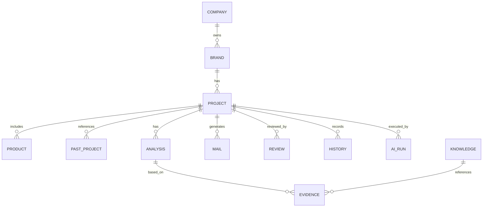

# 08_DOMAIN.md

# 営業AIシステム ドメイン設計書

Version: 1.0  
Status: Draft  
Repository: `sales-ai-system`  
Target: MVP / Version 1

---

## 1. 本書の目的

本書は、営業AIシステムにおける業務ドメインを定義する。

本システムは、CAMPFIRE専用の営業メール生成ツールではなく、営業対象の発見、分析、メール作成、レビュー、ナレッジ蓄積までを扱う営業OSである。

そのため、DB・API・UIを設計する前に、営業業務で扱う主要概念を定義する。

---

## 2. ドメイン設計方針

### 2.1 Domain First

本システムでは、DBやAPIから設計しない。  
まず営業業務上の概念を定義し、その後にDB、API、UIへ落とし込む。

### 2.2 CAMPFIRE専用にしない

Version 1ではCAMPFIREを主対象とする。  
ただし、将来的に以下へ拡張できるよう、ドメインは特定サイトに依存させない。

- Makuake
- GREEN FUNDING
- Kibidango
- Kickstarter
- Shopify
- Instagram
- 企業公式サイト
- 展示会リード
- 紹介営業

### 2.3 AI生成データと人間修正データを分離する

AIが生成した分析・メールと、人間が修正した内容は区別して扱う。  
これは、AI改善・上長レビュー・ナレッジ蓄積のために重要である。

---

## 3. 主要ドメイン一覧

| Domain | 概要 |
|---|---|
| User | システム利用者 |
| Company | 法人・事業者 |
| Brand | 商品やプロジェクトを展開するブランド |
| Project | 営業対象案件 |
| Product | 対象商品 |
| SourceSite | 情報取得元サイト |
| PastProject | 過去プロジェクト |
| Analysis | AIまたは人間による分析 |
| SalesStrategy | 営業切り口 |
| Mail | 営業メール |
| Review | 人間確認・上長確認 |
| Knowledge | 営業ナレッジ |
| History | 操作履歴 |
| Evidence | AI判断の根拠 |
| AIRun | AI実行単位 |

---

## 4. User

### 4.1 定義

本システムを利用するユーザー。

### 4.2 主な役割

- 営業担当者
- 上長
- 管理者

### 4.3 Role

| Role | 説明 |
|---|---|
| sales | 営業担当者 |
| manager | 上長・確認者 |
| admin | 管理者 |

### 4.4 業務上の責務

営業担当者は、AI分析結果や営業メールを確認・修正する。  
上長は、必要に応じて営業メールを承認する。  
管理者は、設定、テンプレート、ユーザー、ナレッジを管理する。

---

## 5. Company

### 5.1 定義

法人または事業者を表す。

### 5.2 例

- ウェザリー・ジャパン株式会社
- 株式会社フルークフォレスト
- Astract Japan LLC

### 5.3 属性

- 会社名
- 住所
- 公式サイトURL
- 問い合わせURL
- 代表者名
- メールアドレス
- 備考

### 5.4 注意点

CAMPFIRE上の実行者名と法人名は一致しない場合がある。  
そのため、CompanyとBrandとProjectは分けて管理する。

---

## 6. Brand

### 6.1 定義

商品やプロジェクトを展開するブランド。

### 6.2 例

- HORIZON ARROW
- BRIGHT_DIY
- Sorge

### 6.3 Companyとの関係

1つのCompanyは複数のBrandを持つ可能性がある。  
1つのBrandは1つのCompanyに紐づくことを基本とするが、会社情報が不明な場合は未紐付けを許容する。

### 6.4 属性

- ブランド名
- ブランド概要
- ブランド軸
- 主な商品ジャンル
- 公式サイトURL
- SNSアカウント
- 備考

---

## 7. Project

### 7.1 定義

営業対象案件を表す。

本システムにおけるProjectは、単なるクラウドファンディングプロジェクトではない。  
営業対象として登録された案件をProjectと呼ぶ。

### 7.2 Version 1でのProject

Version 1では、主にCAMPFIREプロジェクトURLから作成される。

### 7.3 将来拡張

将来的には以下もProjectとして扱う。

- Makuakeプロジェクト
- GREEN FUNDINGプロジェクト
- 企業公式サイト
- Instagramアカウント
- 展示会名刺
- 紹介営業先

### 7.4 属性

- Project ID
- SourceSite
- Source URL
- Project Title
- Company
- Brand
- Product
- Status
- Priority
- Memo
- Created By
- Created At

### 7.5 Status

| Status | 意味 |
|---|---|
| not_analyzed | 未分析 |
| analyzing | 分析中 |
| analyzed | 分析済み |
| human_review | 人間確認中 |
| revised | 修正済み |
| manager_review | 上長確認中 |
| approved | 承認済み |
| sent | 送信済み |
| replied | 返信あり |
| meeting | 商談化 |
| lost | 失注 |
| won | 受注 |

---

## 8. Product

### 8.1 定義

Projectで扱う商品。

### 8.2 属性

- 商品名
- カテゴリ
- 価格
- 特徴
- 良い点
- 想定ターゲット
- 使用シーン
- 注意すべき表現

### 8.3 注意点

商品名はAIが誤認しやすいため、人間が編集可能にする。  
商品性能や効果は、ページ上で確認できる範囲のみ扱う。

---

## 9. SourceSite

### 9.1 定義

情報取得元となるサイト。

### 9.2 初期対応

- CAMPFIRE

### 9.3 将来対応

- Makuake
- GREEN FUNDING
- Kibidango
- Kickstarter
- Indiegogo
- Shopify
- Instagram
- Company Website

### 9.4 属性

- サイト名
- ベースURL
- スクレイピング方式
- 対応ステータス
- 備考

---

## 10. PastProject

### 10.1 定義

同一BrandまたはCompanyが過去に実施したプロジェクト。

### 10.2 目的

ブランドの継続性、得意領域、商品傾向を分析するために使用する。

### 10.3 属性

- プロジェクト名
- URL
- 支援総額
- 支援者数
- 達成率
- 商品カテゴリ
- 今回商品との共通点
- AI分析メモ

---

## 11. Analysis

### 11.1 定義

AIまたは人間が行った分析結果。

### 11.2 分析種別

- Brand Analysis
- Product Analysis
- Past Project Analysis
- SNS Analysis
- Sales Strategy Analysis
- Quality Check

### 11.3 AI生成と人間修正

Analysisは以下を分けて保持する。

- AI生成版
- 人間修正版
- 承認版

### 11.4 属性

- Analysis Type
- AI Generated Content
- Human Edited Content
- Approved Content
- Confidence
- Evidence
- Created By AI Run
- Edited By
- Approved By

---

## 12. SalesStrategy

### 12.1 定義

対象Projectに対する営業切り口。

### 12.2 切り口分類

- クラウドファンディング支援
- SNS集客支援
- SNS動画制作支援
- 広告クリエイティブ支援
- 販売導線設計支援
- LP改善支援
- 採用・求人支援

### 12.3 属性

- 推奨切り口
- 推奨テンプレート
- 推奨理由
- 支援可能ポイント
- 代替切り口
- AI信頼度
- 根拠

---

## 13. Mail

### 13.1 定義

Projectに対して作成される営業メール。

### 13.2 種別

- AI生成メール
- 人間修正メール
- 上長承認メール
- 最終送信メール

### 13.3 属性

- 件名
- 本文
- テンプレート種別
- 使用分析ポイント
- CTA
- ステータス
- 品質チェック結果

### 13.4 禁止事項

メールは人間承認なしに送信してはならない。

---

## 14. Review

### 14.1 定義

人間による確認・修正・承認プロセス。

### 14.2 Review種別

- 営業担当確認
- 上長確認
- 差し戻し
- 承認

### 14.3 属性

- Reviewer
- Review Status
- Comment
- Reviewed At

---

## 15. Knowledge

### 15.1 定義

営業活動から得られた再利用可能な知見。

### 15.2 Knowledge種別

- 上長OKメール
- 返信が来たメール
- 返信が来なかったメール
- 成功件名
- 成功CTA
- NG表現
- 商品ジャンル別表現
- 営業切り口別テンプレート
- 商談メモ
- 提案内容

### 15.3 将来用途

RAGの検索対象とする。

---

## 16. History

### 16.1 定義

操作履歴・変更履歴。

### 16.2 保存対象

- AI生成
- 人間修正
- 承認
- 差し戻し
- ステータス変更
- メール生成
- 品質チェック
- ナレッジ登録
- 再分析

### 16.3 属性

- 操作者
- 操作日時
- 操作種別
- 変更前
- 変更後
- 修正理由

---

## 17. Evidence

### 17.1 定義

AI判断の根拠となる情報。

### 17.2 例

- 商品ページの記載
- 過去プロジェクト
- 支援総額
- 支援者数
- 達成率
- 活動報告
- コメント
- SNS投稿
- 公式サイト情報

### 17.3 目的

AI分析がなぜその結論になったかを、人間が確認できるようにする。

---

## 18. AIRun

### 18.1 定義

AIを実行した単位。

### 18.2 目的

どのAIが、いつ、どの入力から、どの出力を生成したかを追跡する。

### 18.3 属性

- Run ID
- Project ID
- AI Type
- Input JSON
- Output JSON
- Model Name
- Prompt Version
- Status
- Error
- Started At
- Completed At

---

## 19. ドメイン関係図

---

## 20. ドメイン設計上の重要判断

### 20.1 Projectは営業案件である

Projectはクラウドファンディングページそのものではなく、営業対象案件である。  
これにより、将来的に他サイトやオフライン営業にも対応できる。

### 20.2 Analysisは中心ドメインである

本システムは、営業担当者の思考を保存することが重要である。  
そのため、Analysisはメール生成の中間データではなく、重要な資産として扱う。

### 20.3 Mailは成果物である

Mailは分析の結果として生成される成果物である。  
Mailだけを保存するのではなく、Mailがどの分析から作られたかを保存する。

### 20.4 Knowledgeは継続改善の中核である

Knowledgeは将来的にRAGの基盤となる。  
成功・失敗・修正履歴をKnowledge化することで、営業品質を継続的に向上させる。

---

## 21. ドメイン完了条件

本ドメイン設計は、以下を満たした時点で初版完了とする。

- 主要ドメインが定義されている
- 各ドメインの責務が明確である
- Projectが営業案件として定義されている
- AI生成データと人間修正データを分離する方針が定義されている
- EvidenceとAIRunが定義されている
- Knowledgeの将来利用方針が定義されている
