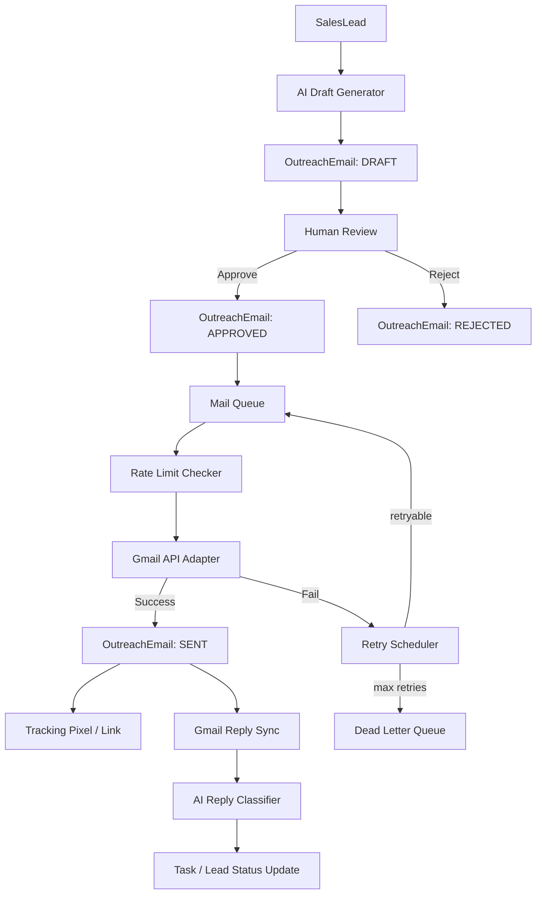
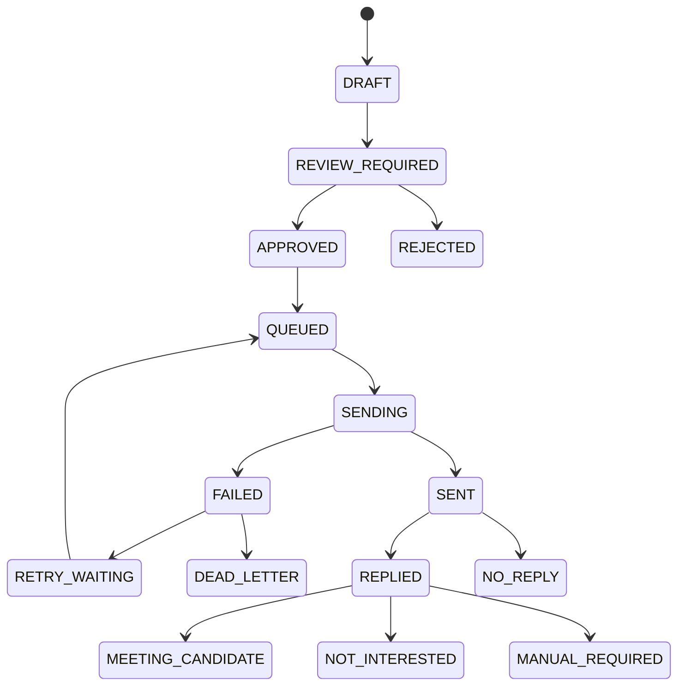

# 09_MAIL.md

## 営業AIシステム Mail 実装仕様

- 対象: 営業AIシステム Phase2
- 位置づけ: Codex 実装用 メール生成・送信・返信管理仕様
- 正本: `docs/09_MAIL.md`
- 関連: `07_DATABASE.md`, `08_DOMAIN.md`, `15_CODEX.md`
- 前提DB: PostgreSQL + Prisma
- 推奨送信基盤: Gmail API / Google Workspace OAuth2
- 代替送信基盤: SMTP Adapter
- 設計方針: AIが作成し、人間が確認し、システムが送信・追跡・返信分類する

---

## 1. 結論

メール機能は営業AIシステムの中核機能として、以下を実装する。

1. 営業候補ごとのメール下書き生成
2. 人間によるレビュー・承認
3. Gmail APIによる送信
4. 送信キュー・レート制限・リトライ制御
5. 開封・クリック計測
6. 返信受信・スレッド管理
7. AIによる返信分類
8. 商談化・NG・要対応タスク化
9. 送信ログ・監査ログ保存
10. 将来のSMTP/SendGrid等への切替に備えたAdapter設計

この仕様では、完全自動送信ではなく、**AI生成 → 人間確認 → 承認送信**を標準フローとする。
営業メールは外部送信物であり、誤送信・過剰送信・重複送信・法令/マナー違反のリスクがあるため、MVPでは人間承認を必須にする。

---

## 2. スコープ

### 2.1 対象範囲

| 区分 | 対象 |
|---|---|
| メール生成 | AIによる件名・本文・CTA生成 |
| テンプレート | 初回営業、リマインド、お礼、商談案内、NG返信、配信停止 |
| 送信 | Gmail API / Google Workspace OAuth2 |
| 送信管理 | Draft, Review, Approved, Queued, Sending, Sent, Failed |
| 返信管理 | Gmailスレッド取得、返信本文保存、分類 |
| 計測 | 開封Pixel、リンククリック、UTM、興味スコア |
| 制御 | Rate Limit、重複防止、送信時間制御、Retry、DLQ |
| 監査 | 操作ログ、送信ログ、AI生成ログ |

### 2.2 対象外

| 区分 | 理由 |
|---|---|
| 完全自動大量送信 | 誤送信・スパム化リスクが高い |
| 個人情報の不要な収集 | MVPでは最小限に限定 |
| Gmail以外の本番送信 | MVPではGmail APIを正本とする |
| 高度なMA機能 | Phase3以降 |
| 法務判断の自動化 | システムは補助のみ。最終判断は人間 |

---

## 3. メール全体アーキテクチャ



---

## 4. 状態遷移

### 4.1 OutreachEmail Status



### 4.2 ステータス定義

| Status | 意味 | 次アクション |
|---|---|---|
| DRAFT | AIまたは人間が下書き作成中 | レビューへ回す |
| REVIEW_REQUIRED | 人間確認待ち | 承認/差戻し |
| APPROVED | 送信承認済み | キュー投入 |
| REJECTED | 却下 | 再生成または終了 |
| QUEUED | 送信待ち | Workerが処理 |
| SENDING | 送信中 | Gmail API実行 |
| SENT | 送信完了 | 計測・返信待ち |
| FAILED | 送信失敗 | Retry判定 |
| RETRY_WAITING | 再試行待ち | 指定時刻に再投入 |
| DEAD_LETTER | 最大再試行超過 | 人間確認 |
| REPLIED | 返信あり | AI分類 |
| NO_REPLY | 一定期間返信なし | リマインド候補 |
| MEETING_CANDIDATE | 商談候補 | タスク作成 |
| NOT_INTERESTED | 興味なし/NG | 追客停止 |
| MANUAL_REQUIRED | 人間対応必要 | タスク作成 |

---

## 5. Gmail API 設計

### 5.1 採用方針

MVPでは Gmail API を標準送信基盤とする。
理由は、Google Workspace契約済み環境との親和性が高く、送信済みメール・スレッド・返信取得を一元的に扱いやすいため。

### 5.2 OAuth2 Scope

実装時は最小権限を原則とする。

| Scope | 用途 |
|---|---|
| `https://www.googleapis.com/auth/gmail.send` | メール送信 |
| `https://www.googleapis.com/auth/gmail.readonly` | 返信・スレッド取得 |
| `https://www.googleapis.com/auth/gmail.modify` | ラベル付与・既読制御が必要な場合 |

MVPでは `gmail.send` と `gmail.readonly` を基本とする。
`gmail.modify` はGmail側にラベルを自動付与する場合のみ使用する。

### 5.3 Gmail送信仕様

| 項目 | 仕様 |
|---|---|
| 送信元 | Google Workspaceの認証済みユーザー |
| Reply-To | 原則送信元と同一 |
| From名 | `株式会社第弐ヴォヌール 山本` など設定値から生成 |
| 本文形式 | `text/plain` と `text/html` の両方を生成 |
| Message-ID | Gmail API結果から保存 |
| Thread-ID | 初回送信時に保存、返信同期で使用 |
| 添付 | MVPではURL添付を基本。ファイル添付はPhase3 |

### 5.4 Adapter Interface

```ts
export type SendMailInput = {
  from: string;
  fromName?: string;
  to: string;
  cc?: string[];
  bcc?: string[];
  replyTo?: string;
  subject: string;
  textBody: string;
  htmlBody?: string;
  headers?: Record<string, string>;
  threadId?: string;
};

export type SendMailResult = {
  provider: 'gmail' | 'smtp';
  providerMessageId: string;
  providerThreadId?: string;
  rawResponse?: unknown;
};

export interface MailSenderAdapter {
  send(input: SendMailInput): Promise<SendMailResult>;
}
```

### 5.5 Gmail Adapter 実装ファイル

```text
src/modules/mail/adapters/gmail-mail-sender.adapter.ts
src/modules/mail/adapters/smtp-mail-sender.adapter.ts
src/modules/mail/adapters/mail-sender.adapter.ts
```

---

## 6. SMTP切替設計

### 6.1 切替条件

| 条件 | 対応 |
|---|---|
| Gmail API制限に到達 | SMTP/外部配信基盤を検討 |
| 複数送信者を扱う | SenderAccountを拡張 |
| 大量配信が必要 | SendGrid等の専用基盤を検討 |
| 到達率管理が必要 | DKIM/SPF/DMARC管理を追加 |

### 6.2 SMTP Adapter Environment

```env
MAIL_PROVIDER=gmail
SMTP_HOST=
SMTP_PORT=587
SMTP_USER=
SMTP_PASSWORD=
SMTP_SECURE=false
```

`MAIL_PROVIDER` は `gmail` を初期値とし、`smtp` を指定した場合のみSMTP Adapterを使う。

---

## 7. 送信キュー設計

### 7.1 Queue構成

| Queue | 用途 |
|---|---|
| `mail.send` | メール送信 |
| `mail.retry` | 再送待ち |
| `mail.reply-sync` | Gmail返信同期 |
| `mail.tracking` | 開封/クリックイベント処理 |
| `mail.ai-classify` | 返信AI分類 |

### 7.2 推奨技術

| 項目 | 推奨 |
|---|---|
| Queue | BullMQ |
| Broker | Redis |
| Worker | Node.js worker process |
| Scheduler | BullMQ repeatable jobs / cron |

### 7.3 Job Payload

```ts
export type SendMailJobPayload = {
  outreachEmailId: string;
  requestedByUserId: string;
  attempt: number;
};
```

### 7.4 Worker処理順序

1. `OutreachEmail` を取得
2. status が `QUEUED` または `RETRY_WAITING` であることを確認
3. 重複送信防止ロックを取得
4. Rate Limitを確認
5. status を `SENDING` に更新
6. Tracking URL / Pixelを本文に埋め込む
7. Gmail APIで送信
8. providerMessageId / providerThreadId を保存
9. status を `SENT` に更新
10. `MailLog` と `AuditLog` を保存
11. 失敗時は Retry 判定

---

## 8. Rate Limit 設計

### 8.1 MVP初期値

| 制御単位 | 初期値 |
|---|---:|
| 1分あたり送信数 | 5通 |
| 1時間あたり送信数 | 50通 |
| 1日あたり送信数 | 200通 |
| 同一ドメイン宛 | 1日10通まで |
| 同一会社宛 | 30日以内に初回営業1通まで |
| 同一案件宛 | 30日以内に初回営業1通まで |

Gmail / Google Workspace の実際の送信上限は契約・設定・アカウント状態で変わるため、固定値として断定しない。システム側では安全側の低い初期値を採用し、管理画面で変更可能にする。

### 8.2 Rate Limit Key

```text
mail:rate:minute:{senderAccountId}:{yyyyMMddHHmm}
mail:rate:hour:{senderAccountId}:{yyyyMMddHH}
mail:rate:day:{senderAccountId}:{yyyyMMdd}
mail:rate:domain:{senderAccountId}:{domain}:{yyyyMMdd}
mail:rate:company:{companyId}:{yyyyMMdd}
```

### 8.3 Rate Limit超過時

| 状態 | 処理 |
|---|---|
| 分制限超過 | 1〜5分後に再投入 |
| 時間制限超過 | 次時間帯に再投入 |
| 日次制限超過 | 翌営業日に再投入 |
| 会社重複 | 送信停止、`DUPLICATE_BLOCKED` |
| 配信停止 | 送信停止、`UNSUBSCRIBED_BLOCKED` |

---

## 9. Retry / DLQ 設計

### 9.1 Retry対象

| エラー | Retry |
|---|---|
| 一時的APIエラー | する |
| 429 Rate Limit | する |
| 5xx | する |
| Timeout | する |
| OAuth期限切れ | 人間確認。ただしRefresh可能なら再試行 |
| 宛先不正 | しない |
| 配信停止対象 | しない |
| 重複送信検知 | しない |

### 9.2 Backoff

| attempt | delay |
|---:|---:|
| 1 | 5分 |
| 2 | 30分 |
| 3 | 2時間 |
| 4 | 翌営業日 |

最大4回失敗した場合は `DEAD_LETTER` にする。

### 9.3 Dead Letter Queue

`DEAD_LETTER` になったメールは自動送信しない。
管理画面で原因確認後、以下のいずれかを選ぶ。

1. 再送
2. 下書きへ戻す
3. 送信中止
4. 宛先修正
5. 担当者へタスク化

---

## 10. 送信時間制御

### 10.1 初期ルール

| 条件 | 仕様 |
|---|---|
| 平日 | 10:00〜17:00送信可 |
| 土日祝 | 原則送信不可 |
| 深夜早朝 | 送信不可 |
| 承認直後が送信不可時間 | 次の送信可能時間にキュー投入 |

祝日判定はPhase2では設定テーブルまたは簡易カレンダーで扱う。外部祝日API連携はPhase3以降。

### 10.2 実装関数

```ts
export function resolveNextSendableAt(now: Date, timezone: string): Date {
  // Asia/Tokyo基準
  // 平日10:00〜17:00ならnow
  // それ以外は次の平日10:00
}
```

---

## 11. 重複送信防止

### 11.1 防止対象

| 対象 | ルール |
|---|---|
| 同一メールID | 送信済みなら再送禁止 |
| 同一会社 | 初回営業は30日以内に1回まで |
| 同一担当者メール | 30日以内に1回まで |
| 同一クラファン案件 | 30日以内に1回まで |
| 配信停止済み | 永続停止 |
| NG返信済み | 追客停止 |

### 11.2 DB制約案

`OutreachEmail` には以下の論理制約を実装する。

- `idempotencyKey` を必須化
- `idempotencyKey` にUnique Index
- `providerMessageId` にUnique Index

`idempotencyKey` 生成例:

```text
initial:{companyId}:{salesLeadId}:{contactPersonId}:{templateKey}:{yyyyMMdd}
```

---

## 12. メールテンプレート設計

### 12.1 Template種別

| key | 用途 |
|---|---|
| `initial_outreach` | 初回営業 |
| `first_reminder` | 初回リマインド |
| `second_reminder` | 2回目リマインド |
| `meeting_request` | 商談案内 |
| `thank_you` | お礼 |
| `not_interested_reply` | NG返信への返信 |
| `unsubscribe_confirm` | 配信停止対応 |
| `manual_followup` | 個別追客 |

### 12.2 変数

| 変数 | 内容 |
|---|---|
| `{{companyName}}` | 会社名 |
| `{{contactName}}` | 担当者名 |
| `{{projectName}}` | クラファン案件名 |
| `{{platformName}}` | CAMPFIRE等 |
| `{{projectUrl}}` | 案件URL |
| `{{observedPoint}}` | AIが見つけた注目点 |
| `{{supporterCount}}` | 支援者数 |
| `{{fundingAmount}}` | 支援金額 |
| `{{serviceIntro}}` | 第弐ヴォヌールの紹介 |
| `{{cta}}` | CTA文 |
| `{{senderName}}` | 送信者名 |
| `{{signature}}` | 署名 |
| `{{unsubscribeUrl}}` | 配信停止URL |

### 12.3 初回営業テンプレート

```text
{{companyName}}
ご担当者様

お世話になっております。
株式会社第弐ヴォヌールの{{senderName}}と申します。

{{platformName}}にて、御社のプロジェクト「{{projectName}}」を拝見し、ご連絡いたしました。

特に、{{observedPoint}}という点から、SNSや短尺動画で商品の使用シーンを伝える余地があるのではないかと感じました。

弊社では、クラウドファンディング支援、SNSマーケティング支援、ショート動画制作を行っております。

もしご関心がございましたら、まずは初回の情報交換という形で、現在のプロジェクトについてお話しできればと思います。

その中で、SNS活用・広告運用・販売導線の観点から、弊社でお力になれそうな点があれば、簡単に共有させていただきます。

{{cta}}

{{signature}}

配信停止をご希望の場合はこちら:
{{unsubscribeUrl}}
```

### 12.4 件名テンプレート

| key | 件名 |
|---|---|
| initial_1 | `{{projectName}}のSNS活用についてのご相談` |
| initial_2 | `{{platformName}}掲載プロジェクトを拝見してご連絡しました` |
| initial_3 | `クラウドファンディング施策についての情報交換のお願い` |
| reminder_1 | `先日ご連絡した件について` |
| meeting_1 | `お打ち合わせ候補日のご相談` |

---

## 13. AIメール生成仕様

### 13.1 生成入力

```ts
export type GenerateMailDraftInput = {
  salesLeadId: string;
  companyId: string;
  projectId?: string;
  contactPersonId?: string;
  templateKey: string;
  tone: 'polite' | 'soft' | 'business' | 'casual_business';
  objective: 'information_exchange' | 'meeting_request' | 'follow_up';
};
```

### 13.2 AIに渡す情報

| 情報 | 必須 | 備考 |
|---|---|---|
| 会社名 | 必須 | なければ「ご担当者様」 |
| 担当者名 | 任意 | 取得できた場合のみ使用 |
| 案件名 | 必須 | クラファン営業の場合 |
| 案件URL | 必須 | 参照元明示用 |
| 支援金額 | 任意 | 数値確認できる場合のみ |
| 支援者数 | 任意 | 数値確認できる場合のみ |
| 商品特徴 | 必須 | AI要約または手入力 |
| 営業仮説 | 必須 | `LeadScore` または `SalesLead` から取得 |
| 禁止表現 | 必須 | 誇大表現防止 |
| 署名 | 必須 | SenderAccountから取得 |

### 13.3 禁止事項

AI生成メールでは以下を禁止する。

| 禁止 | 理由 |
|---|---|
| 実績の捏造 | 信用毀損リスク |
| 未確認数値の断定 | 事実誤認防止 |
| 「必ず売上が上がる」等の保証 | 誇大表現 |
| 相手の失敗を断定 | 失礼・炎上リスク |
| 過度な煽り | 営業品質低下 |
| 個人情報の推測 | プライバシーリスク |
| 法的判断の断定 | 専門外判断のため |

### 13.4 AI Prompt

```text
あなたはBtoB営業メールの作成担当です。
目的は売り込みではなく、初回の情報交換につなげることです。

以下の制約を必ず守ってください。
- 未確認の数値・実績・事実を作らない
- 相手企業の失敗や不足を断定しない
- 「必ず」「確実に」「売上保証」などの表現を使わない
- 営業感を抑え、丁寧で自然な文面にする
- 初回接点として違和感のない長さにする
- CTAは「初回の情報交換」を基本にする
- 件名を3案、本文を1案出す
- 本文には配信停止導線を含める

入力情報:
会社名: {{companyName}}
担当者名: {{contactName}}
クラウドファンディングサイト: {{platformName}}
案件名: {{projectName}}
案件URL: {{projectUrl}}
確認できた支援金額: {{fundingAmountOrUnknown}}
確認できた支援者数: {{supporterCountOrUnknown}}
商品特徴: {{projectSummary}}
営業仮説: {{salesHypothesis}}
弊社紹介: {{serviceIntro}}
署名: {{signature}}

出力形式:
{
  "subjects": ["...", "...", "..."],
  "body": "...",
  "riskNotes": ["..."]
}
```

### 13.5 生成後Validation

生成後に以下を機械チェックする。

| Check | 内容 |
|---|---|
| Empty Check | 件名・本文が空でない |
| Length Check | 件名80文字以下、本文2,000文字以下 |
| NG Word Check | 禁止表現を含まない |
| Fact Check Flag | 数値が入力データと一致しているか |
| URL Check | 不正URLがないか |
| Unsubscribe Check | 配信停止URLが含まれるか |
| Signature Check | 署名が含まれるか |

Validationに失敗した場合は `REVIEW_REQUIRED` にせず `DRAFT_ERROR` として保存し、人間確認に回す。

---

## 14. 開封計測設計

### 14.1 Tracking Pixel

HTMLメールには1x1 pixel画像を埋め込む。

```html

```

### 14.2 注意点

開封計測は完全ではない。
GmailやApple Mail等の画像プロキシ、画像ブロック、セキュリティ設定により、実際の開封と一致しない場合がある。
そのため、開封は参考指標として扱い、営業判断ではクリック・返信を優先する。

### 14.3 Open Event 保存

保存項目:

| 項目 | 内容 |
|---|---|
| outreachEmailId | 対象メール |
| eventType | `OPENED` |
| occurredAt | 発生時刻 |
| ipHash | IPをハッシュ化 |
| userAgent | UA |
| provider | tracking |
| raw | request情報 |

IPアドレスは原則そのまま保存しない。ハッシュ化または保存しない方針とする。

---

## 15. クリック計測設計

### 15.1 Link Tracking

本文内URLはすべてトラッキングURLに置換する。

```text
元URL:
https://example.com/service

変換後:
https://app.example.com/api/mail/track/click/{{trackingToken}}?u={{encodedUrl}}
```

### 15.2 保存イベント

| eventType | 内容 |
|---|---|
| CLICKED | リンククリック |
| OPENED | 開封 |
| BOUNCED | バウンス |
| REPLIED | 返信 |
| UNSUBSCRIBED | 配信停止 |

### 15.3 クリック後処理

1. tokenを検証
2. `TrackedLink` を取得
3. `LinkClick` を保存
4. `EmailEvent` を保存
5. `SalesLead.interestScore` を加点
6. 元URLへ302 redirect

---

## 16. 興味スコア設計

### 16.1 加点ルール

| 行動 | 点数 |
|---|---:|
| 開封 | +1 |
| 資料リンククリック | +5 |
| サービスページクリック | +7 |
| 複数回クリック | +3 |
| 返信あり | +20 |
| 商談希望 | +50 |
| 配信停止 | -100 |
| NG返信 | -50 |

### 16.2 スコア分類

| Score | 分類 | 対応 |
|---:|---|---|
| 50以上 | HOT | 即タスク化 |
| 20〜49 | WARM | フォロー候補 |
| 1〜19 | LOW | リマインド候補 |
| 0以下 | COLD/STOP | 原則追客停止 |

---

## 17. 返信同期設計

### 17.1 同期方式

MVPでは定期ポーリングを採用する。

| 項目 | 仕様 |
|---|---|
| 実行頻度 | 15分〜1時間に1回 |
| 対象 | `SENT` かつ返信未確認のメール |
| 取得 | Gmail threadId でスレッド取得 |
| 保存 | 新規返信のみ `EmailReply` に保存 |
| 分類 | `mail.ai-classify` Queueに投入 |

### 17.2 重複防止

Gmail messageId を `EmailReply.providerMessageId` として保存し、Unique Indexを設定する。

### 17.3 返信本文抽出

返信本文は以下を分離して保存する。

| フィールド | 内容 |
|---|---|
| rawBody | Gmailから取得した原文 |
| plainBody | HTML除去後本文 |
| normalizedBody | 署名・引用を可能な範囲で除去した本文 |

署名・引用除去は100%正確ではないため、原文も必ず保持する。

---

## 18. AI返信分類

### 18.1 分類カテゴリ

| category | 意味 | 対応 |
|---|---|---|
| `MEETING_REQUEST` | 商談・打合せ希望 | 即タスク化 |
| `INTERESTED` | 興味あり | フォロータスク |
| `QUESTION` | 質問あり | 人間対応 |
| `NOT_INTERESTED` | 興味なし | 追客停止 |
| `UNSUBSCRIBE` | 配信停止希望 | 停止処理 |
| `AUTO_REPLY` | 自動返信 | 状態維持 |
| `BOUNCE` | 不達 | 宛先無効化 |
| `OUT_OF_OFFICE` | 不在返信 | 期日後フォロー |
| `MANUAL_REQUIRED` | 判断困難 | 人間確認 |

### 18.2 Prompt

```text
あなたは営業メールの返信分類担当です。
返信本文を読み、営業対応として必要な分類をJSONで返してください。

制約:
- 本文に書かれていない意図を推測しすぎない
- 判断できない場合は MANUAL_REQUIRED にする
- 配信停止、拒否、不達は安全側に分類する
- 商談候補、質問、興味ありは人間対応タスクを作る前提で分類する

分類候補:
MEETING_REQUEST, INTERESTED, QUESTION, NOT_INTERESTED, UNSUBSCRIBE, AUTO_REPLY, BOUNCE, OUT_OF_OFFICE, MANUAL_REQUIRED

返信本文:
{{replyBody}}

出力形式:
{
  "category": "...",
  "confidence": 0.0,
  "reason": "...",
  "recommendedAction": "...",
  "shouldCreateTask": true,
  "shouldStopFollowup": false
}
```

### 18.3 分類後処理

| category | Lead更新 | Task |
|---|---|---|
| MEETING_REQUEST | `MEETING_CANDIDATE` | 作成 |
| INTERESTED | `WARM` | 作成 |
| QUESTION | `MANUAL_REQUIRED` | 作成 |
| NOT_INTERESTED | `STOPPED` | 不要または確認用 |
| UNSUBSCRIBE | `UNSUBSCRIBED` | 不要 |
| AUTO_REPLY | 維持 | 不要 |
| BOUNCE | `INVALID_CONTACT` | 必要に応じて |
| OUT_OF_OFFICE | `FOLLOWUP_LATER` | 作成 |
| MANUAL_REQUIRED | `MANUAL_REQUIRED` | 作成 |

---

## 19. 配信停止設計

### 19.1 配信停止URL

```text
https://app.example.com/unsubscribe/{{unsubscribeToken}}
```

### 19.2 処理

1. token検証
2. contactPerson / emailAddress を停止
3. company単位の停止が必要か選択可能にする
4. `EmailEvent.UNSUBSCRIBED` を保存
5. `AuditLog` 保存
6. 今後の送信キューをキャンセル

### 19.3 停止単位

| 単位 | MVP |
|---|---|
| メールアドレス単位 | 必須 |
| 担当者単位 | 必須 |
| 会社単位 | 任意 |
| ドメイン単位 | Phase3 |

---

## 20. 添付・資料URL設計

### 20.1 MVP方針

添付ファイルではなく、資料URLを本文に含める。
理由は、添付ファイルは到達率低下・容量制限・ウイルスチェック遅延のリスクがあるため。

### 20.2 資料管理

| 種別 | 例 |
|---|---|
| LP | 自社サービス紹介ページ |
| PDF | 営業資料 |
| Video | 制作実績動画 |
| CaseStudy | 実績紹介 |
| Calendar | 日程調整リンク |

資料URLは `TrackedLink` として保存し、クリック計測対象にする。

---

## 21. Prisma Schema 追加仕様

`07_DATABASE.md` のDB仕様に以下のMail系モデルを追加する。
既存モデル名と重複する場合は、既存定義を優先し、この章の項目をマージする。

```prisma
enum MailProvider {
  GMAIL
  SMTP
}

enum OutreachEmailStatus {
  DRAFT
  DRAFT_ERROR
  REVIEW_REQUIRED
  APPROVED
  REJECTED
  QUEUED
  SENDING
  SENT
  FAILED
  RETRY_WAITING
  DEAD_LETTER
  REPLIED
  NO_REPLY
  MEETING_CANDIDATE
  NOT_INTERESTED
  MANUAL_REQUIRED
  DUPLICATE_BLOCKED
  UNSUBSCRIBED_BLOCKED
}

enum EmailEventType {
  CREATED
  APPROVED
  REJECTED
  QUEUED
  SENDING
  SENT
  FAILED
  RETRIED
  DEAD_LETTER
  OPENED
  CLICKED
  REPLIED
  BOUNCED
  UNSUBSCRIBED
}

enum MailTemplateType {
  INITIAL_OUTREACH
  FIRST_REMINDER
  SECOND_REMINDER
  MEETING_REQUEST
  THANK_YOU
  NOT_INTERESTED_REPLY
  UNSUBSCRIBE_CONFIRM
  MANUAL_FOLLOWUP
}

enum ReplyCategory {
  MEETING_REQUEST
  INTERESTED
  QUESTION
  NOT_INTERESTED
  UNSUBSCRIBE
  AUTO_REPLY
  BOUNCE
  OUT_OF_OFFICE
  MANUAL_REQUIRED
}

model SenderAccount {
  id                 String       @id @default(dbgenerated("gen_random_uuid()")) @db.Uuid
  userId             String       @db.Uuid
  provider           MailProvider @default(GMAIL)
  email              String
  displayName        String?
  replyToEmail        String?
  oauthAccessTokenEnc String?
  oauthRefreshTokenEnc String?
  smtpHost           String?
  smtpPort           Int?
  smtpUser           String?
  smtpPasswordEnc    String?
  isActive           Boolean      @default(true)
  dailyLimit          Int          @default(200)
  hourlyLimit         Int          @default(50)
  minuteLimit         Int          @default(5)
  createdAt          DateTime     @default(now())
  updatedAt          DateTime     @updatedAt
  deletedAt          DateTime?

  user               User         @relation(fields: [userId], references: [id])
  outreachEmails     OutreachEmail[]

  @@index([userId])
  @@index([email])
  @@index([isActive])
}

model MailTemplate {
  id            String           @id @default(dbgenerated("gen_random_uuid()")) @db.Uuid
  key           String           @unique
  type          MailTemplateType
  name          String
  description   String?
  subject       String
  textBody      String
  htmlBody      String?
  variables     Json?
  isActive      Boolean          @default(true)
  version       Int              @default(1)
  createdAt     DateTime         @default(now())
  updatedAt     DateTime         @updatedAt
  deletedAt     DateTime?

  outreachEmails OutreachEmail[]

  @@index([type])
  @@index([isActive])
}

model OutreachEmail {
  id                  String              @id @default(dbgenerated("gen_random_uuid()")) @db.Uuid
  companyId           String              @db.Uuid
  salesLeadId         String?             @db.Uuid
  contactPersonId     String?             @db.Uuid
  senderAccountId     String?             @db.Uuid
  mailTemplateId      String?             @db.Uuid

  status              OutreachEmailStatus @default(DRAFT)
  provider            MailProvider        @default(GMAIL)
  toEmail             String
  toName              String?
  fromEmail           String
  fromName            String?
  replyToEmail         String?
  subject             String
  textBody            String
  htmlBody            String?

  idempotencyKey      String              @unique
  providerMessageId   String?             @unique
  providerThreadId    String?
  trackingToken       String              @unique
  unsubscribeToken    String              @unique

  scheduledAt         DateTime?
  approvedAt          DateTime?
  sentAt              DateTime?
  lastOpenedAt        DateTime?
  lastClickedAt       DateTime?
  repliedAt           DateTime?

  retryCount          Int                 @default(0)
  nextRetryAt         DateTime?
  lastErrorCode       String?
  lastErrorMessage    String?

  aiGenerated         Boolean             @default(false)
  aiGenerationId      String?             @db.Uuid
  reviewComment       String?
  approvedByUserId    String?             @db.Uuid
  createdByUserId     String?             @db.Uuid

  createdAt           DateTime            @default(now())
  updatedAt           DateTime            @updatedAt
  deletedAt           DateTime?

  company             Company             @relation(fields: [companyId], references: [id])
  salesLead           SalesLead?          @relation(fields: [salesLeadId], references: [id])
  contactPerson       ContactPerson?      @relation(fields: [contactPersonId], references: [id])
  senderAccount       SenderAccount?      @relation(fields: [senderAccountId], references: [id])
  mailTemplate        MailTemplate?       @relation(fields: [mailTemplateId], references: [id])
  events              EmailEvent[]
  replies             EmailReply[]
  trackedLinks        TrackedLink[]

  @@index([companyId])
  @@index([salesLeadId])
  @@index([contactPersonId])
  @@index([status])
  @@index([providerThreadId])
  @@index([scheduledAt])
  @@index([sentAt])
  @@index([toEmail])
}

model EmailEvent {
  id               String         @id @default(dbgenerated("gen_random_uuid()")) @db.Uuid
  outreachEmailId  String         @db.Uuid
  eventType         EmailEventType
  occurredAt        DateTime       @default(now())
  ipHash            String?
  userAgent         String?
  provider          String?
  raw               Json?
  createdAt         DateTime       @default(now())

  outreachEmail     OutreachEmail  @relation(fields: [outreachEmailId], references: [id])

  @@index([outreachEmailId])
  @@index([eventType])
  @@index([occurredAt])
}

model EmailReply {
  id                  String         @id @default(dbgenerated("gen_random_uuid()")) @db.Uuid
  outreachEmailId      String         @db.Uuid
  providerMessageId    String         @unique
  providerThreadId     String?
  fromEmail            String
  fromName             String?
  toEmail              String?
  subject              String?
  rawBody              String
  plainBody            String?
  normalizedBody       String?
  receivedAt           DateTime
  category             ReplyCategory?
  classificationScore  Float?
  classificationReason String?
  recommendedAction    String?
  shouldCreateTask     Boolean        @default(false)
  shouldStopFollowup   Boolean        @default(false)
  classifiedAt         DateTime?
  createdAt            DateTime       @default(now())
  updatedAt            DateTime       @updatedAt

  outreachEmail        OutreachEmail  @relation(fields: [outreachEmailId], references: [id])

  @@index([outreachEmailId])
  @@index([providerThreadId])
  @@index([fromEmail])
  @@index([receivedAt])
  @@index([category])
}

model TrackedLink {
  id               String         @id @default(dbgenerated("gen_random_uuid()")) @db.Uuid
  outreachEmailId  String         @db.Uuid
  token            String         @unique
  originalUrl       String
  label            String?
  linkType         String?
  createdAt        DateTime       @default(now())
  updatedAt        DateTime       @updatedAt

  outreachEmail    OutreachEmail  @relation(fields: [outreachEmailId], references: [id])
  clicks           LinkClick[]

  @@index([outreachEmailId])
  @@index([linkType])
}

model LinkClick {
  id            String      @id @default(dbgenerated("gen_random_uuid()")) @db.Uuid
  trackedLinkId String      @db.Uuid
  occurredAt    DateTime    @default(now())
  ipHash        String?
  userAgent     String?
  referer        String?
  raw            Json?

  trackedLink    TrackedLink @relation(fields: [trackedLinkId], references: [id])

  @@index([trackedLinkId])
  @@index([occurredAt])
}
```

---

## 22. API仕様

### 22.1 API一覧

| Method | Path | 用途 |
|---|---|---|
| POST | `/api/mail/drafts/generate` | AI下書き生成 |
| GET | `/api/mail/drafts` | 下書き一覧 |
| GET | `/api/mail/:id` | メール詳細 |
| PATCH | `/api/mail/:id` | 下書き編集 |
| POST | `/api/mail/:id/review` | レビューへ回す |
| POST | `/api/mail/:id/approve` | 承認 |
| POST | `/api/mail/:id/reject` | 却下 |
| POST | `/api/mail/:id/queue` | 送信キュー投入 |
| POST | `/api/mail/:id/retry` | 手動再送 |
| GET | `/api/mail/templates` | テンプレ一覧 |
| POST | `/api/mail/templates` | テンプレ作成 |
| PATCH | `/api/mail/templates/:id` | テンプレ更新 |
| GET | `/api/mail/threads/:threadId` | スレッド詳細 |
| POST | `/api/mail/replies/sync` | 返信同期実行 |
| GET | `/api/mail/track/open/:token` | 開封計測 |
| GET | `/api/mail/track/click/:token` | クリック計測 |
| GET | `/unsubscribe/:token` | 配信停止画面 |
| POST | `/api/unsubscribe/:token` | 配信停止実行 |

### 22.2 AI下書き生成

```http
POST /api/mail/drafts/generate
Content-Type: application/json

{
  "salesLeadId": "uuid",
  "templateKey": "initial_outreach",
  "tone": "soft",
  "objective": "information_exchange"
}
```

Response:

```json
{
  "outreachEmailId": "uuid",
  "status": "REVIEW_REQUIRED",
  "subjects": [
    "クラウドファンディング施策についての情報交換のお願い"
  ],
  "selectedSubject": "クラウドファンディング施策についての情報交換のお願い",
  "body": "...",
  "riskNotes": []
}
```

### 22.3 承認

```http
POST /api/mail/{id}/approve
Content-Type: application/json

{
  "scheduledAt": "2026-07-09T10:00:00+09:00"
}
```

### 22.4 クリック計測

```http
GET /api/mail/track/click/{token}
```

処理成功時は元URLへ `302 Found` でリダイレクトする。
不正tokenの場合は404または安全なエラーページを返す。

---

## 23. Service分割

```text
src/modules/mail/
  mail.module.ts
  mail.controller.ts
  mail.service.ts
  services/
    mail-draft-generator.service.ts
    mail-review.service.ts
    mail-queue.service.ts
    mail-send.service.ts
    mail-retry.service.ts
    mail-rate-limit.service.ts
    mail-tracking.service.ts
    mail-reply-sync.service.ts
    mail-reply-classifier.service.ts
    unsubscribe.service.ts
  adapters/
    mail-sender.adapter.ts
    gmail-mail-sender.adapter.ts
    smtp-mail-sender.adapter.ts
  repositories/
    outreach-email.repository.ts
    mail-template.repository.ts
    email-event.repository.ts
    email-reply.repository.ts
    tracked-link.repository.ts
  workers/
    mail-send.worker.ts
    mail-retry.worker.ts
    mail-reply-sync.worker.ts
    mail-ai-classify.worker.ts
  dto/
    generate-mail-draft.dto.ts
    approve-mail.dto.ts
    update-mail-draft.dto.ts
  types/
    mail.types.ts
```

---

## 24. Repository責務

| Repository | 責務 |
|---|---|
| OutreachEmailRepository | メール本体のCRUD、状態更新 |
| MailTemplateRepository | テンプレート取得・更新 |
| EmailEventRepository | イベント保存 |
| EmailReplyRepository | 返信保存・重複判定 |
| TrackedLinkRepository | リンク作成・token検索 |

状態更新は原則Repository経由にし、Serviceから直接Prismaで複雑な更新をしない。

---

## 25. トランザクション設計

### 25.1 承認時

1. `OutreachEmail.status = APPROVED`
2. `approvedAt`, `approvedByUserId` 保存
3. `EmailEvent.APPROVED` 保存
4. `AuditLog` 保存

これらは同一トランザクションで行う。

### 25.2 送信成功時

1. `OutreachEmail.status = SENT`
2. `providerMessageId`, `providerThreadId`, `sentAt` 保存
3. `EmailEvent.SENT` 保存
4. `AuditLog` 保存

送信API呼び出し自体は外部I/Oのため、DBトランザクション内に長時間含めない。
送信前に `SENDING` に更新し、送信後に結果を保存する。

---

## 26. セキュリティ設計

### 26.1 Token

| token | 用途 | 要件 |
|---|---|---|
| trackingToken | 開封計測 | 推測困難 |
| trackedLink.token | クリック計測 | 推測困難 |
| unsubscribeToken | 配信停止 | 推測困難・長期有効 |

TokenはUUIDではなく、`crypto.randomBytes(32).toString('base64url')` 等で生成する。

### 26.2 OAuth Token

OAuth Access Token / Refresh Token は平文保存しない。
DB保存時は暗号化する。

```ts
encryptSecret(token: string): string

decryptSecret(encrypted: string): string
```

暗号鍵は `.env` で管理し、Git管理しない。

### 26.3 個人情報

| 情報 | 方針 |
|---|---|
| メールアドレス | 業務上必要な範囲で保存 |
| IPアドレス | 原則ハッシュ化 |
| UserAgent | 保存可。ただし分析用途に限定 |
| 返信本文 | 業務対応に必要なため保存 |
| 不要データ | 定期削除方針をPhase3で追加 |

---

## 27. エラー設計

### 27.1 Error Code

| Code | 内容 | Retry |
|---|---|---|
| `MAIL_INVALID_RECIPIENT` | 宛先不正 | No |
| `MAIL_DUPLICATE_BLOCKED` | 重複送信防止 | No |
| `MAIL_UNSUBSCRIBED_BLOCKED` | 配信停止済み | No |
| `MAIL_RATE_LIMITED` | Rate Limit | Yes |
| `MAIL_PROVIDER_429` | Provider制限 | Yes |
| `MAIL_PROVIDER_5XX` | Provider障害 | Yes |
| `MAIL_TIMEOUT` | Timeout | Yes |
| `MAIL_OAUTH_EXPIRED` | OAuth期限切れ | Conditional |
| `MAIL_OAUTH_REVOKED` | OAuth無効 | No |
| `MAIL_UNKNOWN_ERROR` | 不明 | Yes |

### 27.2 エラー保存

`OutreachEmail.lastErrorCode` と `lastErrorMessage` に最新エラーを保存する。
詳細は `EmailEvent.raw` に保存する。

---

## 28. テスト方針

### 28.1 Unit Test

| 対象 | テスト内容 |
|---|---|
| MailDraftGenerator | Prompt入力・Validation |
| RateLimitService | 制限判定 |
| RetryService | Backoff算出 |
| TrackingService | token検証・イベント保存 |
| ReplyClassifier | 分類結果処理 |
| UnsubscribeService | 停止処理 |

### 28.2 Integration Test

| 対象 | テスト内容 |
|---|---|
| Gmail Adapter | mock APIで送信成功/失敗 |
| Queue Worker | job処理・retry |
| API | draft生成〜承認〜queue投入 |
| Reply Sync | messageId重複防止 |

### 28.3 E2E Test

MVP E2E:

1. SalesLead作成
2. AI下書き生成
3. 人間承認
4. キュー投入
5. 送信成功mock
6. 開封イベント保存
7. クリックイベント保存
8. 返信取得mock
9. AI分類
10. Task作成

---

## 29. Seed データ

### 29.1 MailTemplate Seed

```ts
const templates = [
  {
    key: 'initial_outreach',
    type: 'INITIAL_OUTREACH',
    name: '初回営業メール',
    subject: '{{platformName}}掲載プロジェクトを拝見してご連絡しました',
    textBody: '...'
  },
  {
    key: 'first_reminder',
    type: 'FIRST_REMINDER',
    name: '初回リマインド',
    subject: '先日ご連絡した件について',
    textBody: '...'
  },
  {
    key: 'meeting_request',
    type: 'MEETING_REQUEST',
    name: '商談案内',
    subject: 'お打ち合わせ候補日のご相談',
    textBody: '...'
  }
];
```

---

## 30. Codex 実装指示

Codexは以下の順序で実装する。

### 30.1 Step 1: Prisma追加

1. `schema.prisma` にMail系EnumとModelを追加
2. 既存の `User`, `Company`, `ContactPerson`, `SalesLead` との relation を確認
3. migration作成
4. seedにMailTemplateを追加

### 30.2 Step 2: Mail Module作成

1. `src/modules/mail` を作成
2. DTO / types / repositories を作成
3. Serviceを責務別に分割
4. ControllerにAPIを実装

### 30.3 Step 3: AI下書き生成

1. `MailDraftGeneratorService` を実装
2. Prompt builderを作成
3. NG word validationを実装
4. `OutreachEmail` に保存

### 30.4 Step 4: Review / Approve

1. 下書き編集API
2. レビュー依頼API
3. 承認API
4. 却下API
5. AuditLog連携

### 30.5 Step 5: Queue / Worker

1. BullMQ設定
2. `mail.send` Queue作成
3. `MailSendWorker` 実装
4. Rate Limit実装
5. Retry / DLQ実装

### 30.6 Step 6: Gmail Adapter

1. Gmail API client作成
2. OAuth token復号
3. MIME message生成
4. send API実行
5. providerMessageId / threadId 保存

### 30.7 Step 7: Tracking

1. trackingToken生成
2. HTML本文にPixel埋め込み
3. URL置換
4. open/click API作成
5. Event保存
6. Lead interestScore更新

### 30.8 Step 8: Reply Sync / Classification

1. Gmail thread取得
2. 新規返信保存
3. AI分類Queue投入
4. category別にLead/Task更新

### 30.9 Step 9: Test

1. Unit Test
2. Integration Test
3. E2E Test
4. 送信事故防止テスト

---

## 31. 実装時の禁止事項

Codexは以下をしてはいけない。

1. 承認なしで初回営業メールを自動送信しない
2. 配信停止済み宛先に送信しない
3. 重複送信防止を省略しない
4. OAuth Tokenを平文保存しない
5. IPアドレスを無加工で長期保存しない
6. Gmail API上限を固定値として断定しない
7. AI生成文をValidationなしで承認状態にしない
8. 送信失敗を握りつぶさない
9. Retry無限ループを作らない
10. `docs` の仕様と異なる独自実装をしない

---

## 32. 将来拡張

| 拡張 | 内容 |
|---|---|
| SendGrid対応 | 大量送信・到達率管理 |
| DKIM/SPF/DMARC管理 | ドメイン認証管理 |
| Gmail Push Notification | Pub/Subによる返信検知 |
| 商談日程調整連携 | Google Calendar連携 |
| A/B Test | 件名・本文比較 |
| ステップメール | 条件分岐フォロー |
| テンプレ評価 | 返信率・クリック率分析 |
| チーム送信者管理 | 複数担当者From対応 |
| 法務チェック | 禁止表現・業法チェック強化 |

---

## 33. 完了条件

`09_MAIL.md` の実装完了条件は以下。

- AI下書き生成ができる
- 人間レビュー・承認ができる
- 承認済みメールのみ送信キューに入る
- Gmail API Adapterで送信できる
- 送信ログが保存される
- Rate Limitが効く
- Retry / DLQが効く
- 開封・クリックイベントが保存される
- 返信同期ができる
- AI返信分類ができる
- HOT返信はTask化される
- 配信停止が機能する
- テストが通る

---

## 34. 次ドキュメントへの接続

次に作成する `10_AI.md` では、以下を詳細化する。

1. AI生成共通基盤
2. Prompt管理
3. 生成履歴
4. 禁止表現チェック
5. 営業候補スコアリング
6. メール生成AI
7. 返信分類AI
8. AI出力の監査・再現性


---

# 追補: 2026-07-08 整合性修正

## 1. 結論

本追補により、Mail仕様と `prisma/schema.prisma`、`openapi/openapi.yaml` の整合を補正する。

## 2. 追加確認項目

- メール添付・資料URLは `MailAttachment` で管理する。
- メールイベントは `EmailEventType` enumで管理する。
- 返信分類は `ReplyCategory` enumで管理する。
- AIメール生成履歴は `AiGeneration(type=email_draft)` として保存する。
- クリック計測は `TrackedLink` と `LinkClick` を使う。

## 3. Codex実装条件

- 承認なし送信は禁止。
- `MAIL_SEND_ENABLED=false` では実送信しない。
- `Company.isBlocked=true` または `ContactPerson.isUnsubscribed=true` の場合は409を返す。
- Workerは同じjobが複数回実行されても二重送信しない。
